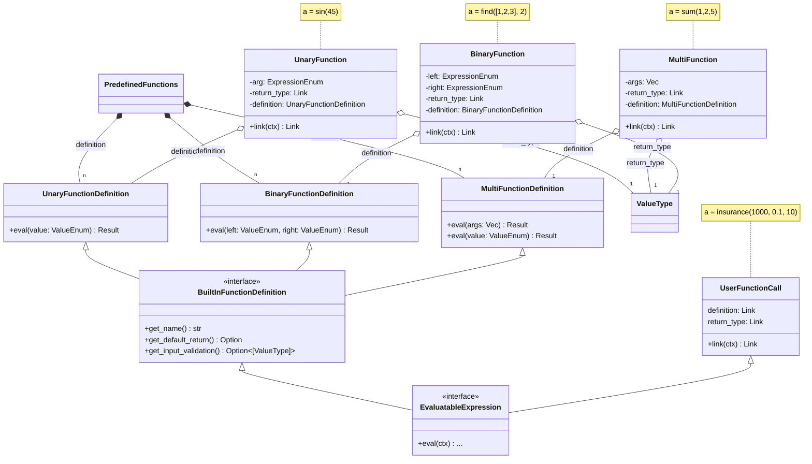

```mermaid
classDiagram
    class PredefinedFunctions {
    }

    class UnaryFunctionDefinition {
        +eval(value: ValueEnum) Result<ValueEnum, RuntimeError>
    }

    class BinaryFunctionDefinition {
        +eval(left: ValueEnum, right: ValueEnum) Result<ValueEnum, RuntimeError>
    }

    class MultiFunctionDefinition {
        +eval(args: Vec<ValueEnum>) Result<ValueEnum, RuntimeError>
        +eval(value: ValueEnum) Result<ValueEnum, RuntimeError>
    }

    class UserFunctionCall {
        definition: Link<FunctionContext>
        return_type: Link<ValueType>
        +link(ctx) Link<ValueType>
    }

    class UnaryFunction {
        -arg: ExpressionEnum
        -return_type: Link<ValueType>
        -definition: UnaryFunctionDefinition
        +link(ctx) Link<ValueType>
    }

    class BinaryFunction {
        -left: ExpressionEnum
        -right: ExpressionEnum
        -return_type: Link<ValueType>
        -definition: BinaryFunctionDefinition
        +link(ctx) Link<ValueType>
    }

    class MultiFunction {
        -args: Vec<ExpressionEnum>
        -return_type: Link<ValueType>
        -definition: MultiFunctionDefinition
        +link(ctx) Link<ValueType>
    }

    class BuiltInFunctionDefinition {
        <<interface>>
        +get_name() str
        +get_default_return() Option<ValueType>
        +get_input_validation() Option<[ValueType]>
    }

    class EvaluatableExpression {
        <<interface>>
        +eval(ctx) ...
    }

    %% Inheritance (as in the original)
    UnaryFunctionDefinition <|-- BuiltInFunctionDefinition
    BinaryFunctionDefinition <|-- BuiltInFunctionDefinition
    MultiFunctionDefinition  <|-- BuiltInFunctionDefinition

    BuiltInFunctionDefinition <|-- EvaluatableExpression
    UserFunctionCall         <|-- EvaluatableExpression

    %% Associations / Aggregations / Compositions
    PredefinedFunctions *-- "n" UnaryFunctionDefinition : definition
    UnaryFunction o-- "1" UnaryFunctionDefinition : definition
    UnaryFunction o-- "1" ValueType : return_type

    PredefinedFunctions *-- "n" MultiFunctionDefinition : definition
    MultiFunction o-- "1" MultiFunctionDefinition : definition
    MultiFunction o-- "1" ValueType : return_type

    PredefinedFunctions *-- "n" BinaryFunctionDefinition : definition
    BinaryFunction o-- "1" BinaryFunctionDefinition : definition
    BinaryFunction o-- "1" ValueType : return_type

    %% Notes
    note for UserFunctionCall "a = insurance(1000, 0.1, 10)"
    note for UnaryFunction "a = sin(45)"
    note for BinaryFunction "a = find([1,2,3], 2)"
    note for MultiFunction "a = sum(1,2,5)"
```

---
