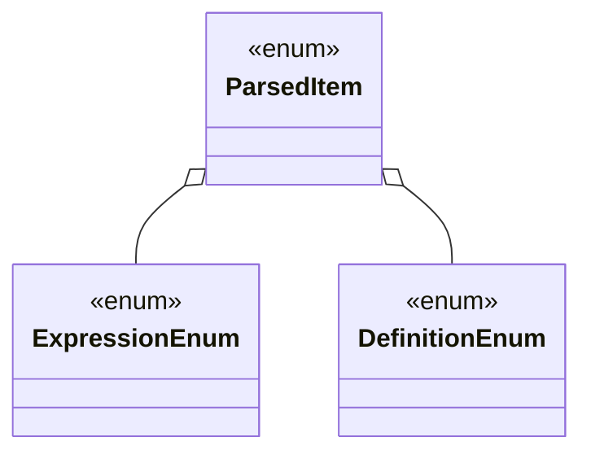

class diagram

```mermaid
classDiagram
    class ParsedItem {
        <<enum>>
    }

    class ExpressionEnum {
        <<enum>>
    }

    class DefinitionEnum {
        <<enum>>
    }
    
    ParsedItem o-- ExpressionEnum
    ParsedItem o-- DefinitionEnum
```