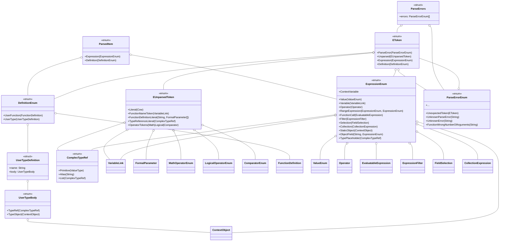

AST token/AST relationship graph (mirrors definitions in `src/ast/token.rs` and parsing/edge runtime helpers).

```mermaid
classDiagram
    direction TB

    class ParsedItem {
        <<enum>>
        +Expression(ExpressionEnum)
        +Definition(DefinitionEnum)
    }

    class EToken {
        <<enum>>
        +ParseError(ParseErrorEnum)
        +Unparsed(EUnparsedToken)
        +Expression(ExpressionEnum)
        +Definition(DefinitionEnum)
    }

    class EUnparsedToken {
        <<enum>>
        +Literal(Cow<str>)
        +FunctionNameToken(VariableLink)
        +FunctionDefinitionLiteral(String, FormalParameter[])
        +TypeReferenceLiteral(ComplexTypeRef)
        +OperatorTokens(Math|Logical|Comparator)
    }

    class ExpressionEnum {
        <<enum>>
        +Value(ValueEnum)
        +Variable(VariableLink)
        +ContextVariable
        +Operator(Operator)
        +RangeExpression(ExpressionEnum, ExpressionEnum)
        +FunctionCall(EvaluatableExpression)
        +Filter(ExpressionFilter)
        +Selection(FieldSelection)
        +Collection(CollectionExpression)
        +StaticObject(ContextObject)
        +ObjectField(String, ExpressionEnum)
        +TypePlaceholder(ComplexTypeRef)
    }

    class DefinitionEnum {
        <<enum>>
        +UserFunction(FunctionDefinition)
        +UserType(UserTypeDefinition)
    }

    class UserTypeDefinition {
        <<struct>>
        +name: String
        +body: UserTypeBody
    }

    class UserTypeBody {
        <<enum>>
        +TypeRef(ComplexTypeRef)
        +TypeObject(ContextObject)
    }

    class ParseErrorEnum {
        <<enum>>
        +UnexpectedToken(EToken)
        +UnknownParseError(String)
        +UnknownError(String)
        +FunctionWrongNumberOfArguments(String)
        +...
    }

    class ParseErrors {
        <<struct>>
        +errors: ParseErrorEnum[]
    }

    class ComplexTypeRef {
        <<enum>>
        +Primitive(ValueType)
        +Alias(String)
        +List(ComplexTypeRef)
    }

    ParsedItem o-- ExpressionEnum
    ParsedItem o-- DefinitionEnum

    EToken o-- ParseErrorEnum
    EToken o-- EUnparsedToken
    EToken o-- ExpressionEnum
    EToken o-- DefinitionEnum

    ParseErrors o-- ParseErrorEnum
    ParseErrors o-- EToken

    EUnparsedToken o-- VariableLink
    EUnparsedToken o-- ComplexTypeRef
    EUnparsedToken o-- FormalParameter
    EUnparsedToken o-- MathOperatorEnum
    EUnparsedToken o-- LogicalOperatorEnum
    EUnparsedToken o-- ComparatorEnum

    DefinitionEnum o-- FunctionDefinition
    DefinitionEnum o-- UserTypeDefinition
    UserTypeDefinition o-- UserTypeBody
    UserTypeBody o-- ContextObject

    ExpressionEnum o-- ValueEnum
    ExpressionEnum o-- VariableLink
    ExpressionEnum o-- Operator
    ExpressionEnum o-- EvaluatableExpression
    ExpressionEnum o-- ExpressionFilter
    ExpressionEnum o-- FieldSelection
    ExpressionEnum o-- CollectionExpression
    ExpressionEnum o-- ContextObject
    ExpressionEnum o-- ComplexTypeRef

    ParseErrorEnum o-- EToken
```
