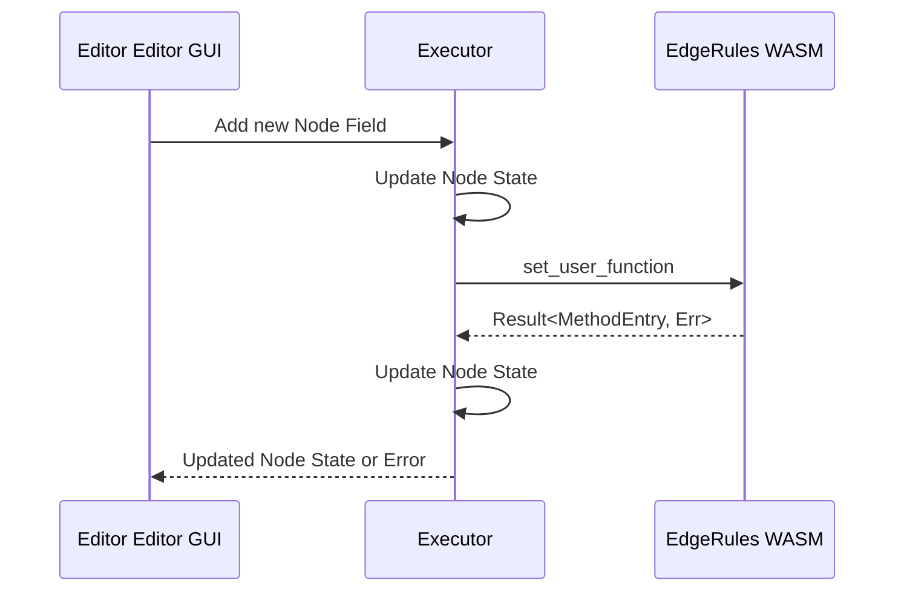

# Edge Rules API Story

**Rust EdgeRulesModel API**

Rust module API for EdgeRules model manipulation:

- `set_user_function`, `get_user_function`, `remove_user_function`
- `set_user_type`, `get_user_type`, `remove_user_type`
- `set_expression`, `get_expression`, `remove_expression`
- `merge_context_object` - used to append existing ContextObject into the model. Might be used in the
  future to support Markdown page execution.
- `get_context_object` - retrieve the current ContextObject from the model. Will be used to serialize the model into
  EdgeRules Portable format.
- `append_source` - similar to merge_context_object, but works with plain EdgeRules DSL source code.
  Used for testing.
- `EdgeRulesModel::new()` - create an empty model.

**WASM EdgeRulesModel API**

WASM bindings are used in EdgeRules Editor GUI to manipulate the model on the fly with ReactFlow front-end.
Also, this API will be used for test cases execution and EdgeRules execution on the edge in general. Requirements:

1. Support building models programmatically (e.g., from JSON/JsValue) instead of EdgeRules DSL strings.
2. Incrementally compose or update expressions, user-defined types, and user functions.
3. Inspect and remove previously defined items.

> It could be that for plain rules execution another WASM module will be released that do not have model mutation APIs.

**_Stand-alone stateless EdgeRules WASM API:_**

- `evaluate_all` - evaluate all expressions in the model and return the full context object as JsValue.
- `evaluate_expression` - evaluate a single expression by its field name and return the result as JsValue.
- `evaluate_field` - evaluate a field in the context object by its path and return the result as JsValue.

@Todo: deprecate and remove `evaluate_method`

**_Stateful EdgeRules WASM API for decision service:_**

- `create_decision_service` - create a decision service from EdgeRules Portable, that could be loaded from the storage
- `execute_decision_service` - execute a decision service method with a given request object
- `get_decision_service_model` - retrieve the current decision service model as EdgeRules Portable that could be
  persisted as a project.
- `set_to_decision_service_model` - adds or overrides expressions, user types, user functions in the current decision
  service model based on EdgeRules Portable input.
- `remove_from_decision_service_model` - removes expressions, user types, user functions from the current decision
  service model based on fully qualified name provided.
- `get_from_decision_service_model` - retrieves expressions, user types, user functions from the current decision
  service model based on fully qualified name provided.

## Rust EdgeRulesModel API

The current public API on `EdgeRulesModel` is limited to:

- `append_source(&str) -> Result<(), ParseErrors>` (legacy: `load_source`)
- `to_runtime(self) -> Result<EdgeRulesRuntime, LinkingError>`
- `to_runtime_snapshot(&mut self) -> Result<EdgeRulesRuntime, LinkingError>`

`append_source` tokenizes the provided string via `tokenizer::parser::tokenize` (which itself uses
`ASTBuilder` to reduce the token stream) and feeds the resulting expressions or definitions into
`ContextObjectBuilder`. Once the caller is ready to execute rules, the builder is turned into a
`ContextObject` tree and linked (`link_parts`) to produce an `EdgeRulesRuntime`.

This approach is convenient for instant execution services/CLI, but is insufficient for EdgeRules Editor GUI
where user edits and executes code on the fly.

**_Clarifications:_**

- **set operations** override existing entries if the name already exists.
- **remove operations** do nothing if the name does not exist.
- **get operations** return None if the name does not exist.
- **fully qualified names** are supported for `field_name`, `type_name`, and `function_name` parameters
  (e.g., `other.enabled`, `other.MyType`, `other.myFunction`). Array indexing is not supported, only dot notation.

### Expressions Rust API

```
set_expression(field_name: &str, expression: ExpressionEnum) -> Result<ExpressionEntry, ContextUpdateErrorEnum>
remove_expression(field_name: &str) -> Result<(), ContextUpdateErrorEnum>
get_expression(field_name: &str) -> Option<Rc<RefCell<ExpressionEntry>>>
```

**Example 1**

After applying `model.set_expression("enabled", ExpressionEnum::from(true))?;`
appends an internal structure:

```
{
    enabled: true
}
```

After applying `model.set_expression("other.enabled", ExpressionEnum::from(true))?;`
an exception should be thrown because `other` context does not exist yet.

After applying `model.set_expression("other", ExpressionEnum::from(ContextObjectBuilder::new().build()?))?;`
an internal structure is:

```
{
    enabled: true
    other: {
    }
}
```

After applying `model.set_expression("other.enabled", ExpressionEnum::from(true))?;`
an internal structure is:

```
{
    enabled: true
    other: {
        enabled: true
    }
}
```

### User Types Rust API

```
set_user_type(type_name: &str, type_definition: UserTypeBody) -> Result<UserTypeBody, ContextUpdateErrorEnum>
remove_user_type(type_name: &str) -> Result<(), ContextUpdateErrorEnum>
get_user_type(type_name: &str) -> Option<UserTypeBody>
```

**Example 2**

After applying `model.set_user_type("MyType", UserTypeBody::from("string"))?;`
the internal EdgeRules Language structure is:

```
{
    type MyType: string;
}
```

After applying `model.set_user_type("other.MyType", UserTypeBody::from("string"))?;`
an exception should be thrown because `other` context does not exist yet so there's no place to put
scoped type `MyType`.

### User Functions Rust API

```
set_user_function(function_name: &str, definition: FunctionDefinition) -> Result<MethodEntry, ContextUpdateErrorEnum>
remove_user_function(function_name: &str) -> Result<(), ContextUpdateErrorEnum>
get_user_function(function_name: &str) -> Option<Rc<RefCell<MethodEntry>>>
```

**Example 3**

After applying `model.set_user_function("other.newFunction", definition)?;` where already existing model looks like
this:

```
{
    other: {
    }
}   
```

the internal structure is:

```
{
    other: {
        func newFunction(a,b,c): {
            ...
        }
    }
}
```

### Context Objects Rust API

```
merge_context_object(object: Rc<RefCell<ContextObject>>) -> Result<(), ContextUpdateErrorEnum>
get_context_object() -> Rc<RefCell<ContextObject>>
append_source(code: &str) -> Result<(), ParseErrors>
```

# EdgeRules Schema

EdgeRules can be represented in the following formats that have input and output compatibility:

**EdgeRules Language**

- Represented in EBNF specification
- JSON like structure
- Human-readable and writable

**EdgeRules Portable**

- Represented in TypeScript interface schema and EBNF specification
- JSON valid structure
- Suitable for REST and persistent storage

Validate: https://www.bottlecaps.de/rr/ui

## EdgeRules Language EBNF Specification

```ebnf
Sep ::= ";" | ( "\r\n" | "\n" | "\r" )

Context ::= "{" ( Statement ( Sep Statement )* Sep? )? "}"

InlineTypeDefinition ::= "<" ComplexType ">"
ComplexTypeDefinition ::= "{" ( TypeField ( Sep TypeField )* Sep? )? "}"

TypeField ::= Identifier ":" ( ComplexTypeDefinition | InlineTypeDefinition )

Statement ::=
      "type" TypeAlias ":" ( ComplexTypeDefinition | InlineTypeDefinition )
    | "func" Identifier "(" ( Parameter ( "," Parameter )* )? ")" ":" ( Expression | Context )
    | Identifier ":" ( Expression | Context )

// --- Types & Ids ---
PrimitiveType ::= "string" | "number" | "boolean" | "date" | "time" | "datetime" | "duration"
TypeAlias     ::= [A-Z][A-Za-z0-9_]*
ComplexType   ::= (PrimitiveType | TypeAlias) ("[]")*

Identifier  ::= [A-Za-z_][A-Za-z0-9_]*
Parameter   ::= Identifier ( ":" (PrimitiveType | TypeAlias) ("[]")* )?

// `Expression` is your existing (or to-be-defined) expression grammar.
```

> Clarifications:
> - Inside type definition block it is necessary to specify actual type within angle brackets `<type>`.
> - Outside type definitions, types can be referenced by their alias without angle brackets.

@TBD: It might be possible to define function within type definition block, but this is not yet supported.

### Example EdgeRules Code:

```edgerules
{
    type Customer: { 
        name: <string>; 
        income: <number>; 
        expense: <number>; 
        tags: <string[]> 
    }
    func customerDetails(customer: Customer): {
        self: customer
        financialInformation: {
            total: self.income + self.expense
            savings: self.income - self.expense
            isProfitable: self.income > self.expense
        }
        status: {
            tagCount: count(self.tags)
            func hasTag(customer, tag: string): {
                result: contains(customer.tags, tag)
            }
            isVIP: hasTag(self, "vip").result
        }
    }
    customerData: {
        name: "Alice"; 
        income: 1000; 
        expense: 400;
        tags: ["vip", "premium"]
    }
    detailedCustomer: customerDetails(customerData)
}
```

## EdgeRules Portable EBNF Specification

Portable version is simplified JSON like structure to transfer or persist EdgeRules definitions.

### Example Portable Object:

```json
{
  "@version": "1.0",
  "@model_name": "Example 1: Customer Model",
  "Customer": {
    "@type": "type",
    "name": "<string>",
    "income": "<number>",
    "expense": "<number>",
    "tags": "<string[]>"
  },
  "customerDetails": {
    "@type": "function",
    "@parameters": {
      "customer": "Customer"
    },
    "self": "customer",
    "financialInformation": {
      "total": "self.income + self.expense",
      "savings": "self.income - self.expense",
      "isProfitable": "self.income > self.expense"
    },
    "status": {
      "hasTag": {
        "@type": "function",
        "@parameters": {
          "customer": "Customer",
          "tag": "string"
        },
        "result": "contains(customer.tags, tag)"
      },
      "tagCount": "count(self.tags)",
      "isVIP": "hasTag(self, 'vip').result"
    }
  },
  "customerData": {
    "name": "Alice",
    "income": 1000,
    "expense": 400,
    "tags": [
      "vip",
      "premium"
    ]
  },
  "detailedCustomer": "customerDetails(customerData)"
}
```

### TypeScript Interface:

```typescript
export type TypeAtom = "string" | "number" | "boolean" | "date" | "time" | "datetime" | "duration";
export type PortableScalar = string | number | boolean;
export type PortableValue = PortableScalar | PortableScalar[] | PortableObject | PortableObject[];
export type PortableExpressionString = string;

export type AngleTypeRef = `<${TypeAtom}>` | `<${TypeAtom}[]>` | `<${string}>` | `<${string}[]>`;

export interface PortableTypeDefinition {
    "@type": "type";

    [fieldName: string]: AngleTypeRef | PortableTypeDefinition;
}

export type ParamTypeRef = TypeAtom | `${TypeAtom}[]` | string | `${string}[]`;

export interface PortableFunctionDefinition {
    "@type": "function";
    "@parameters": Record<string, ParamTypeRef>;

    [k: string]: PortableValue | PortableExpressionString;
}

export interface PortableInvocationDefinition {
    "@type": "invocation";
    "@method": string;
    "@arguments"?: (PortableValue | PortableExpressionString)[];
}

export interface PortableObject {
    [key: string]:
        | PortableValue
        | PortableExpressionString
        | PortableTypeDefinition
        | PortableFunctionDefinition
        | PortableInvocationDefinition;
}

export interface PortableContext extends PortableObject {
    "@version"?: string | number;
    "@model_name"?: string;
}
```

## Helper Methods

- `toPortable(edgerules: string): PortableContext` - Converts EdgeRules code to Portable Object.
  @TBC: probably another EdgeRules WASM method.
- `fromPortable(portable: PortableContext): string` - Converts Portable Object back to EdgeRules code.
  @TBC: probably another EdgeRules WASM method.

# Decision Service Story

EdgeRules must expose decision service capabilities.

## Terminology:

- **stand-alone model** - evaluatable model that does not have any external context or requires any input
- **decision service** - an API with a model that that exposes decision service method to evaluate with a given context
  and input
- **decision request** - a request object passed to the decision service model to the decision service method
- **decision service method** - a method defined in a service model. There can be multiple decision methods in a service
  model
- **decision response** - the result of a decision service method call
- **decision service model** - an EdgeRules model that contains at least one decision service method
- **extended context** - a context that contains input data, provided context, decision service model and evaluated
  expressions
- **decision trace** - a trace of the decision service execution that contains final extended content
  and all intermediate steps (TBC)

## Requirements:

- decision service model must be linked and reused for the next **decision service method** call
  to avoid re-linking and unnecessary overhead
- after each **decision service method** call, the decision service model must be reusable
  for the next call without any side effects from the previous execution
- If **decision service method** has none or more than one argument, return an error with a proper message
- Only one `DecisionService` instance that have only one `EdgeRulesModel` can be created in WASM at a time

## Decision Service API

**Mutable Decision Service** API is more extensive to support EdgeRules Editor GUI.
There will be another WASM release of **Immutable Decision Service** API only for rules execution on the edge.

`#[cfg(feature = "mutable_decision_service")]` feature is enabled by default.

Decision service is implemented in `decision_service.rs` and tests are in `tests/decision_service_tests.rs`.

### Rust API

```
struct DecisionService {
    ... // holds EdgeRulesModel with AST inside it
    ... // holds linked EdgeRulesRuntime that can be reused multiple times
}
...
impl DecisionService {
    pub fn from_context(ctx: Rc<RefCell<ContextObject>>) -> Result<Self, Error>
    ...
    pub fn from_source(source: &str) -> Result<Self, Error>
    ...
    pub fn execute(&mut self, service_method: &str, decision_request: ValueEnum) -> Result<ValueEnum, EvalError>
    ...
    #[cfg(feature = "mutable_decision_service")]
    pub fn get_model(&mut self) -> Rc<RefCell<EdgeRulesModel>>
    ...
}
```

### WASM API

As of now only one decision service can be created and used at a time.

```
#[wasm_bindgen]
create_decision_service(model: &JsValue) -> JsValue {
    // ...
    // initializing new DecisionService and storing it in static variable
    // loaded model is parsed and linked
}

#[wasm_bindgen]
execute_decision_service(service_method: &str, decision_request: &JsValue) -> JsValue {
    // ...
}

#[wasm_bindgen]
get_decision_service_model() -> JsValue {
    // ...
}

#[wasm_bindgen]
set_to_decision_service_model(path: &str, object: &JsValue) -> JsValue {
    // ...
}

#[wasm_bindgen]
remove_from_decision_service_model(path: &str) -> JsValue {
    // ...
}

#[wasm_bindgen]
get_from_decision_service_model(path: &str) -> JsValue {
    // ...
}
```

## Decision Service Invocation API

EdgeRules will support adding invocation expressions that simply calls already defined user functions.
Each invocation follows `[instance]: [method]([arguments])`, for example
`applicationResponse: applicationDecisions(input.application)`.

- `instance` is ContextObject expression
- `method` is expression with `UserFunctionCall`
- `arguments` can be one or more arguments that are `UserFunctionCall` `args`.

**Limitations:**

- only user functions can be invoked, as of now built-in functions are not supported
- argument expressions must be valid `VariableLink` expressions or values.
  As of now, complex expressions are not supported.

**Model API (Rust)**

- Introduce `InvocationSpec { method_path: String, arguments: Vec<ExpressionEnum> }`.
- `EdgeRulesModel::set_invocation(path: &str, spec: InvocationSpec) -> Result<(), ContextUpdateErrorEnum>` stores
  an invocation as `ExpressionEnum::from(UserFunctionCall::new(spec.method_path, spec.arguments))` in the context,
  creating intermediate contexts like `set_expression`.
- Invocation can be removed with existing `remove_expression`

**WASM / Portable API**

- `set_to_decision_service_model` / `get_from_decision_service_model` accept invocations with payload:

  ```json
  {
    "@type": "invocation",
    "@method": "applicationDecisions", // fully qualified names allowed to call nested functions
    "@arguments": ["input.application"] // portable value or expression strings
  }
  ```

- Optional helper: `set_invocation(path: &str, invocation: &JsValue) -> JsValue` as a convenience wrapper that
  returns the updated portable snippet; `remove_from_decision_service_model` removes the invocation like any
  expression entry.
- `@arguments` defaults to the provided decision request when omitted for single-parameter methods to mirror the
  current `execute_decision_service` contract.

### Example

A valid model in EdgeRules Portable format:

```json
{
  "applicationDecisions": {
    "@type": "function",
    "@parameters": {
      "application": null
    },
    "isEligible": "application.age >= 18"
  }
}
```

Injecting new function and invocation in `applicationDecisions`:

```javascript
// Inserting scholarshipCalc function inside applicationDecisions function
wasm.set_to_decision_service_model("applicationDecisions.scholarshipCalc", {
    "@type": "function",
    "@parameters": {
        "age": "number"
    },
    "result": "if (age < 25) { 1000 } else { 500 }"
});

// Modifying applicationDecisions to include scholarship calculation
wasm.set_to_decision_service_model("applicationDecisions.scholarship", {
    "@type": "invocation",
    "@method": "applicationDecisions",
    "@arguments": [
        "application.age"
    ]
});

wasm.execute_decision_service("applicationDecisions", {
    "application": {
        "age": 22
    }
});
```

output:

```json
{
  "isEligible": true,
  "scholarship": {
    "result": 1000
  }
}
```

**Todo:**

- [ ] Implement Decision Service Invocation API
- [ ] Add Example to the `ds-demo.mjs` as a separate example
- [ ] Run tests with `just demo-node` and fix any errors
- [ ] Add required Rust tests with happy and unhappy paths
- [ ] `set_to_decision_service_model` should also return linking errors if any
- [ ] Update `ds-demo.mjs` with unhappy linkin error scenario

**Notes:**

No performance considerations should be made for `set_to_decision_service_model`,
because this method will be used in EdgeRules Editor GUI only for model manipulation.
However, all code must be maintained with best coding practices.

# Execution Sequence inside Editor Editor GUI

## Simple Node Update



## Code Loading and Decision Service Creation


# Known Limitations

1. Decision service functions API do not accept decision service name so for now only one decision service can
   be created at a time in WASM.
2. Decision service functions API do not support multiple arguments.
3. EdgeRulesModel API do not support metadata so "@type" will be derived from the context
   and version, model_name will be lost.

# Outstanding Questions
