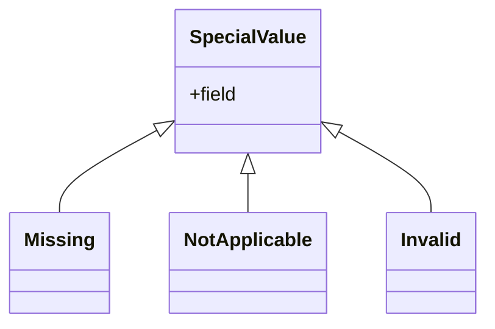

## Special Values Story (v2)

EdgeRules fault-tolerant strategy provides special values for various unexpected situations.
Each special value has a specific meaning and treatment.

Special Value has this structure:

```ebnf
SpecialValue ::= "Missing" | "NotApplicable" | "Invalid" ("(" Origin , Trace ")")?
Origin ::= StringLiteral
Trace ::= StringLiteral
```



| Name            | Description                         | Treatment                                        | Can be assigned by user? |
|-----------------|-------------------------------------|--------------------------------------------------|--------------------------|
| `Missing`       | value is expected, but not found    | override by `Missing`                            | Yes                      |
| `NotApplicable` | value is not expected and not found | treat as 0, 1 or "" to bypass in any calculation | Yes                      |
| `Invalid`       | value validation was not passed     | override by `Invalid`                            | No - system only         |

## Considerations and Limitations

- Special value `NotFound` (value entry is not found) will not be implemented as of now. This value is treated the same
  as `Missing`,
  but it cannot be assigned by the user. It is only assigned by the system in specific cases.
- Special value trace will not be implemented as of now.
- Casting to boolean from any non-boolean type yields `false`.
- Warning mechanism is not implemented as of now, but planned in the future.

## Todo

- As of now, there are no literals for special values so technically user cannot assign special values in the model.
  This will be added in the future.

## Common Special Value Treatment

All special values have the same basic treatment:
1. In lists or iterations, special values are treated as valid entries: `[1, Missing, 3][1]` → `Missing`,
   `for n in [1,2,Missing,4] return n + 1` → `[2,3,Missing,5]`, `count([1,2,Missing,4])` → `4`
2. In objects, special values are treated as valid field values: `{a: Missing}.a` → `Missing`.
3. In filtering, special values are ignored: `[1,2,Missing,4][x > 2]` → `[4]`.
4. In type casting, special values are treated as valid values and if source has special value for the field, target will
   also have the same special value for that field.
5. All logical operations and comparisons with special values, will result to `false`, even special value field is
   compared to itself.

> Special Values cannot be assigned to booleans. If boolean field is absent or any validation problem, it will be `false`.

> Consider each built-in function documentation for details how special values are treated.

## Missing

Missing has a high similarity to JavaScript `null`, but has fault-tolerant treatment.
Missing can be assigned by the user to any type except boolean to inform execution that data was not provided, but
expected.
Missing is also assigned by the system if no data is provided to the function or data is missing in casting operation.

### Missing Treatment

In general, user should think about `Missing` as null, that propagates in all operations and yields `Missing` as result.

1. In arithmetic operations, it propagates `Missing`: `1 + Missing` → `Missing`, `1 * Missing` → `Missing`.
2. In string concatenation, it propagates `Missing`: `"a" + Missing` → `Missing`.
3. If `Missing` appeared as an argument in any built-in function, the result is `Missing` depending on built-in implementation.
For example all aggregation functions will result to `Missing`: `sum([1,2,Missing,4])` → `Missing`, 
all filtering and comparison related functions might return a value: `max([1,2,Missing,4])` → `4`.

## NotApplicable

Special value that informs the execution that it must be ignored in all operations if possible.
Can be assigned to numbers, strings and dates.

### NotApplicable Treatment:

In general, user should think about `NotApplicable` as a value that is ignored in all operations if it makes sense or
possible.

1. In arithmetic operations, it is treated as 0 or 1 respectively: `1 + NotApplicable` → `1`, `1 * NotApplicable` → `1`.
2. In string concatenation, it is treated as an empty string `""`: `"a" + NotApplicable` → `"a"`.
3. In lists `NotApplicable` is ignored where possible, but still holds a place in a list:
`count([1,2,NotApplicable,4])` → `4`, `sum([1,2,NotApplicable,4])` → `7`, `max([1,2,Missing,4])` → `4`, 
`mean([1,2,NotApplicable,4])` → `2.3333`

## NotFound (will not be implemented as of now)

Has a high similarity to JavaScript `undefined`, but has fault-tolerant treatment. It is only assigned by the system
and cannot be assigned by the user.

> `NotFound` is treated same as `Missing` in all operations.

### Occurrence (will not be implemented as of now)

1. Array index is out of bounds: `[1,2,3,4][4]` → `NotFound`.
2. `find` function does not find the value: `find([1,2,3], 4)` → `NotFound`.
3. Accessing a non-existing field in an object: `for item in [{a:1},{a:2},{b:3}] return item.a` → `[1, 2, NotFound(a)]`.

## Invalid

Special value that informs the execution that the value validation was not passed.
It is only assigned by the system and cannot be assigned by the user.

> `Invalid` is treated same as `Missing` in all operations.

### Occurrence

1. Value does not conform to the expected type during casting operation: `{a: "string"} as {a: number}` → `{a:
   Invalid}`.
2. Value does not pass predefined validation rules (TBC).

It is treated same as `Missing` in all operations.

# Special value methods

- `isMissing(x)`, `isNotApplicable(x)`, `isInvalid(x)`, `isSpecialValue(x)`, `isPresent(x)`

## Examples

```edgerules
{
    // Missing examples
    a: Missing
    b: [1, 2, Missing, 4]
    c: for n in b return n + 1          // [2, 3, Missing, 5]
    d: sum(b)                           // Missing('b')
    e: count(b)                         // 4
    f: a = Missing                      // false
    g: isMissing(a)                     // true

    // NotApplicable examples
    h: NotApplicable
    i: [1, 2, NotApplicable, 4]
    j: for n in i return n + 1          // [2, 3, NotApplicable, 5]
    k: sum(i)                           // 12 (NotApplicable treated as 0)
    l: count(i)                         // 4
    m: h = NotApplicable                // false
    n: isNotApplicable(h)               // true

    // Mixed examples
    t: [1, Missing, NotApplicable, Invalid] 
    u: for n in t return n               // [1, Missing, NotApplicable, Invalid]
    v: sum(t)                            // Missing('t')
    w: count(t)                          // 4
}
```